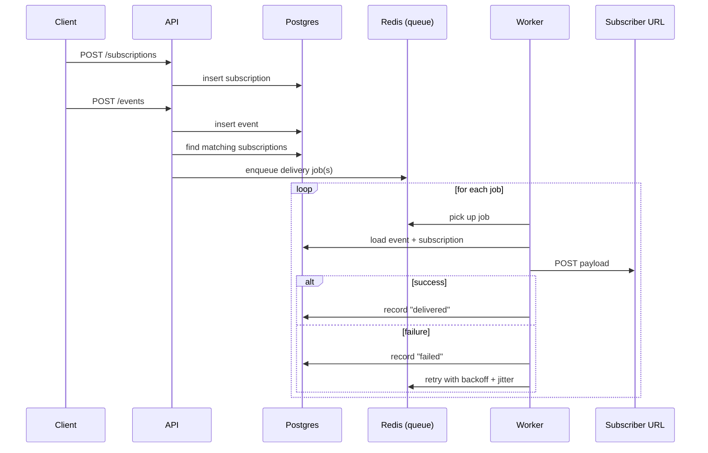

# webhook-service

An API that ingests events and manages subscriptions, paired with a
worker that delivers those events to subscribers with automatic
retries — a small, self-contained example of event-driven delivery.

## Structure

```
apps/
  api/        Express app — POST /events, POST /subscriptions, GET /deliveries, GET /subscriptions
  worker/     BullMQ worker — delivers events, retries on failure
  dashboard/  Vue 3 + Vite — live delivery log, polls the API every 3s
packages/
  shared/     DB pool + shared types used by both apps
docker-compose.yml   Redis + Postgres
```

## Setup

```bash
pnpm install
cp .env.example .env
docker compose up -d
pnpm dev              # runs api + worker + dashboard together via turbo
```

## Try it

Go to [webhook.site](https://webhook.site) and copy the unique URL it
gives you — you'll use that as `targetUrl` below. A placeholder like
`.../your-id` isn't real, so nothing will show up if you use it.

```bash
# register a subscriber
curl -X POST localhost:3000/subscriptions \
  -H "Content-Type: application/json" \
  -d '{"eventType":"user.created","targetUrl":"https://webhook.site/YOUR-REAL-ID","secret":"supersecret123"}'

# fire an event
curl -X POST localhost:3000/events \
  -H "Content-Type: application/json" \
  -d '{"type":"user.created","payload":{"email":"a@b.com"}}'
```

Open **http://localhost:5173** to watch deliveries land live, and
check your webhook.site tab to see the actual POST arrive.

## How it works



- **API** only accepts requests and describes work — it never delivers anything itself.
- **Jobs are lightweight**: just an event ID and subscription ID, not the payload. The worker re-fetches the real data from Postgres, keeping the database as the single source of truth.
- **Retries are declarative**: the queue is configured with 5 attempts, exponential backoff, and jitter (a random ±50% variance on each delay) so a burst of failed deliveries doesn't retry in lockstep against the same subscriber. BullMQ handles the timing — no retry loop written by hand.
- **API and worker are independent processes**, coordinating only through Redis and Postgres. You can restart the worker mid-delivery and nothing is lost — pending jobs just wait in Redis.
